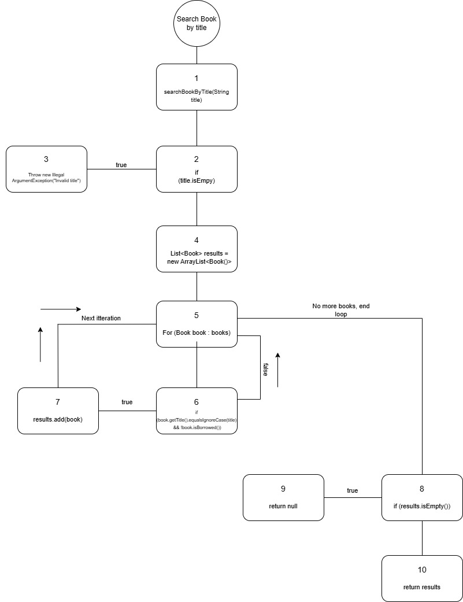
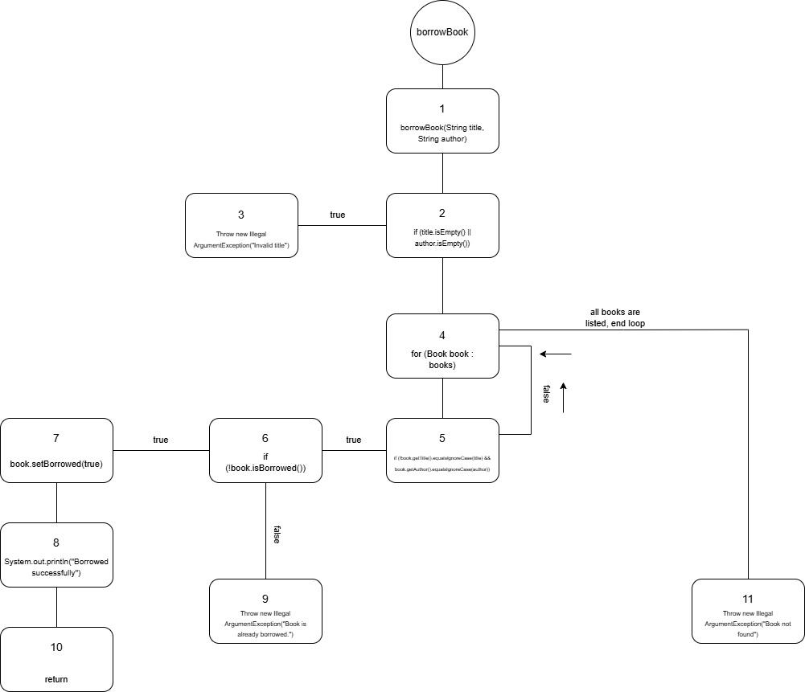

# Марио Димески (236060)

##  Анализа на функциите

### 1. searchBookByTitle
Оваа функција овозможува пребарување на достапни книги според нивниот наслов.

<p align="center">
  
  <br>
  <i>Слика 1: Граф на контролен тек за searchBookByTitle</i>
</p>

**Цикломатска комплексност:**
Цикломатската комплексност за првиот граф го решив така што го зедов и ги изброив предикатните јазли  ($P$) и воедно ја искористив формулата **CC = P + 1**:
* **P = 5** (if за празен наслов, for циклус, два услови во if со &&, и последен if за празна листа).
* **CC = P + 1 = 6**

---

### 2. borrowBook
Функција за изнајмување на книга со проверка на автор и статус на достапност.

<p align="center">
  
  <br>
  <i>Слика 2: Граф на контролен тек за borrowBook</i>
</p>

**Цикломатска комплексност:**
Цикломатската комплексност ја пресметав на истиот начин каде што ги броев предикатните јазли и ја искористив истата формула **CC = P + 1**:
* **P = 6** (|| кај наслов/автор, for циклус, && кај наслов/автор во циклусот, и if за статус на изнајмување).
* **CC = P + 1 = 7**

---
### Тест случаи според критериумот Every Statement
### Функцијата - searchBookByTitle
### Тест 1 :
 
 ```java
 /**  
 * Case 1: empty title -> expected exception
 */ 
 assertThrows(IllegalArgumentException.class, () -> library.searchBookByTitle(""));
 ```
 
со овај тест пример ги покриваме линиите од **57** - **58** односно
```java
57 if (title.isEmpty() || author.isEmpty()) {
58  throw new IllegalArgumentException("Invalid search query");
}
```
---
### Тест 2:
```java
/**  
 * Case 2: searching for 1 book -> expected book to be found 
 */
 assertEquals("Clean Code", bookList.get(0).getTitle());
```

со овај тест ги поркиваме линиите **57 па 60 - 63 па 66 па 69** 
```java
57 if (title.isEmpty())
```

```java
60 List<Book> results = new ArrayList<Book>();  
61 for (Book book : books) {  
62    if (book.getTitle().equalsIgnoreCase(title) && !book.isBorrowed()) {  
63        results.add(book);
        }
}
```

```java
66 if (results.isEmpty()) {  
67    return null;  
}
```
---
### Тест 3
```java
/**  
 * Case 3: Empty library with no books -> expected null 
 */
 assertNull(bookList2);
```

со овај тест ги покриваме линиите **57 па 60 - 61 па 66 - 67**
```java
57 if (title.isEmpty() || author.isEmpty()){  
    throw new IllegalArgumentException("Invalid search query");  
}
```

```java
60 List<Book> results = new ArrayList<Book>();  
61 for (Book book : books) {  
    if (book.getTitle().equalsIgnoreCase(title) && !book.isBorrowed()) {  
        results.add(book);  
    }  
}
```

```java
66 if (results.isEmpty()) {  
67    return null;  
}
```
---
### Тест 4
```java
/**  
 * Case 4: Searching for a book that doesn't exist -> expected null
 */
 assertNull(bookList3);
```

со овај тест ги покриваме линиите **57 па 60 - 62 па 66 - 67**
```java
57 if (title.isEmpty() || author.isEmpty()){  
    throw new IllegalArgumentException("Invalid search query");  
}
```

```java
60 List<Book> results = new ArrayList<Book>();  
61 for (Book book : books) {  
62    if (book.getTitle().equalsIgnoreCase(title) && !book.isBorrowed()) {  
        results.add(book);  
    }  
}
```

```java
66 if (results.isEmpty()) {  
67    return null;  
}
```
---
### Тест случаи според критериумот Every Branch

### Функцијата - searchBookByTitle

Оваа функција 	овозможува позајмување на книга доколку не е веќе позајмена

### Тест 1
```java
/**  
 * Case 1: empty title and author -> expected exception
 */
assertThrows(IllegalArgumentException.class,() -> library.borrowBook("",""));
```
Со овај тест добиваме **true** на првата гранка:
```java
if (title.isEmpty() || author.isEmpty()){  
    throw new IllegalArgumentException("Invalid search query");  
}
```
--- 
### Тест 2
```java
/**  
 * Case 2: borrowing book -> expected null meaning that book is borrowed */library.borrowBook("Clean Code", "Robert C. Martin");  
  
assertNull(library.searchBookByTitle("Clean Code"));
```
Со овај тест добиваме **false** на првата гранка
```java
if (title.isEmpty() || author.isEmpty()){  
    throw new IllegalArgumentException("Invalid search query");  
}
```
Добиваме **true** на втората гранка:
```java
if (book.getTitle().equalsIgnoreCase(title) && book.getAuthor().equalsIgnoreCase(author)) {  
//  if (!book.isBorrowed()) {  
//      book.setBorrowed(true);  
//      System.out.println("Borrowed successfully");  
//   } else {  
//     throw new RuntimeException("Book is already borrowed.");  
//   }  
     return;  
    }  
```
Добиваме **true** на третата гранка:
```java
if (!book.isBorrowed()) {  
    book.setBorrowed(true);  
    System.out.println("Borrowed successfully");  
} else {  
    throw new RuntimeException("Book is already borrowed.");  
}
```
---
### Тест 3
```java
/**  
 * Case 3: borrowing a book that doesn't exist -> expected exception 
 */
assertThrows(RuntimeException.class, () -> library.borrowBook("xyz","xyz"));
```
Со овај тест добиваме **false** на првата гранка:
```java
if (title.isEmpty() || author.isEmpty()){  
    throw new IllegalArgumentException("Invalid search query");  
}
```
Добиваме **false** на втората гранка, и со тоа не стасуваме воопшто до третата гранка.

---
### Тест 4

```java
/**  
 * Case 4: borrowing a book that is already borrowed -> expected exception
 */
assertThrows(RuntimeException.class,() -> library.borrowBook("Clean Code","Robert C. Martin"));
```
Со овај тест добиваме **false** на првата гранка:
```java
if (title.isEmpty() || author.isEmpty()){  
    throw new IllegalArgumentException("Invalid search query");  
}
```
Добиваме **true** на втората гранка:
```java
if (book.getTitle().equalsIgnoreCase(title) && book.getAuthor().equalsIgnoreCase(author)) {  
//  if (!book.isBorrowed()) {  
//      book.setBorrowed(true);  
//      System.out.println("Borrowed successfully");  
//   } else {  
//     throw new RuntimeException("Book is already borrowed.");  
//   }  
     return;  
    }  
```
Добиваме **false** на третата гранка:
```java
if (!book.isBorrowed()) {  
    book.setBorrowed(true);  
    System.out.println("Borrowed successfully");  
} else {  
    throw new RuntimeException("Book is already borrowed.");  
}
```
### Потребно е минимум 4 тест случаи за да се покрие функцијата "borrowBook" а воедно ги исполлнува условите за "Every Branch" критериумот
